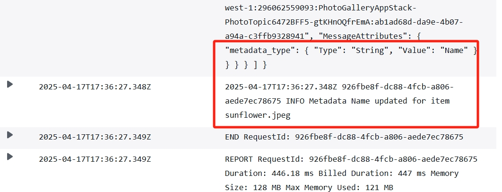

## Distributed Systems - Event-Driven Architecture.

__Name:__ Sihan Ma

__Demo__: https://youtu.be/qe3Mrn925fE 

This repository contains the implementation of a skeleton design for an application that manages a photo gallery, illustrated below. The app uses an event-driven architecture and is deployed on the AWS platform using the CDK framework for infrastructure provisioning.

### Code Status.

[Advice: In this section, state the status of your submission for each feature listed below. The status options are: (1) Completed & Tested; (2) Attempted (i.e. partially works); (3) Not Attempted. Option (1) implies the feature performs the required action (e.g. updates the table) __only when appropriate__, as dictated by the relevant filtering policy described in the specification.]

__Feature:__
+ Photographer:
  + **Log new Images** – ✅ **Completed & Tested** 
     ⤷ Uploading `.jpeg` or `.png` triggers SQS → Lambda → DynamoDB logging
  + **Metadata updating** – ✅ **Completed & Tested** 
     ⤷ SNS messages with metadata_type (Caption / Date / Name) are correctly filtered and handled
  + **Invalid image removal** – ✅ **Completed & Tested** 
     ⤷ Invalid file types (e.g., `.txt`) routed to DLQ → deleted via Lambda
  + **Status Update Mailer** – ✅ **Completed & Tested** 
     ⤷ Moderator updates trigger SNS → Mailer, verified via logs and SES delivery
+ Moderator
  + **Status updating** – ✅ **Completed & Tested** 
     ⤷ SNS messages update image status and reason in DynamoDB
  + **Filtering** – ✅ **Completed & Tested** 
     ⤷ SNS filter policies ensure only relevant Lambda functions are triggered
  + **Messaging** – ✅ **Completed & Tested** 
     ⤷ End-to-end event flow verified from S3 → SNS → SQS/Lambda → DynamoDB/SES

### Notes (Optional)

I implemented function-level event filtering through SNS filterPolicy. For example, when a user uploads a picture and triggers an SNS notification, only messages containing "metadata_type" and whose values are "Caption", "Date" or "Name" will be sent to the Lambda AddMetadataFunction for processing. If the message contains "eventType": "Review", it will only be received by StatusUpdateMailerFunction, which will then execute the logic of sending emails.

At the same time, I also explicitly configured IAM permissions in Lambda through addToRolePolicy, such as adding SES SendEmail permissions to the function that sends emails.

The specific log is shown in the screenshot below:

#### (1) Add meta data

##### SNS filtering has been verified:

- The SNS message contains the MessageAttribute of "metadata_type"
- only AddMetadataFunction is triggered (confirmed by the log RequestId and function name).
- No other Lambda (such as StatusUpdateMailerFunction) is triggered, indicating that the SNS filterPolicy is working correctly.

#### (2) Update Status

#### (3) Remove invalid file

#### (4) Status update email

##### SNS Filtering takes effect：

- When receiving an SNS event, the message attribute value contains "eventType": "Review".
- The log clearly shows that StatusUpdateMailer is triggered, not other functions.

#### (5) BucketNotificationsHandler & customS3AutoDeleteObjectCust

